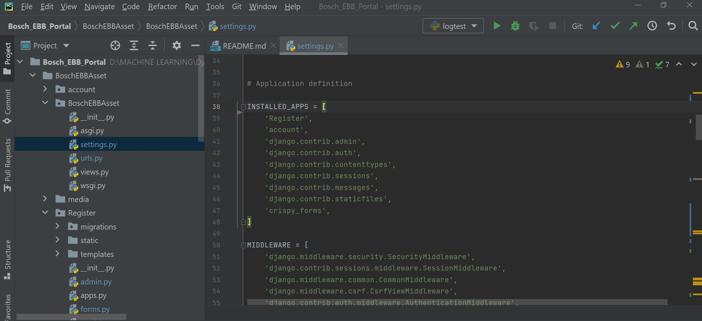

# Bosch EBB ASSET MANAGEMENT SYSTEM

## Installation

1. Install Python
Install python-3.7.2 and python-pip. Follow the steps from the below reference document based on your Operating System. Reference: https://docs.python-guide.org/starting/installation/
   
   
2. Install Django
Follow this steps https://www.djangoproject.com/download/
   
## Required python packages of this project

1. Install pandas :- For reading csv files
https://pypi.org/project/pandas/
   

2. Install django-import-export packages: For importing excel file into the server and connecting into the database

"pip install django-import-export" in the command prompt. 

3. Install mysqlclient: For connecting from django server to mysql database.

"pip install mysqlclient" in the command prompt

4. Install csv,tablib : For excel/csv dataset reading.
   
## Set up  the Project environment in pycharm
1) Creating a new project of Project name BoschEBBAsset in the pycharm

2) Go to the terminal of the project

3) Apply command "django-admin startproject BoschEBBAsset"

4) Now create four app account, Dashboard, home , Register in the BoschEBBAsseet project by using the command in the project terminal "python manage.py startapp app_name"

5) Now each and every app create templates and static folder, templates for html files whereas static for javascript ,css and images files

## Edit the project setting

Add all the apps in the project settings.py file

## Adding the URLS of the project file

## Starting the server
1) python manage.py makemigrations

2) python manage.py migrate

3) Run the command in the terminal"python manage.py runserver"

4) Click on the local host http://127.0.0.1:8000/
First user need to sign in the page , if new user
   then sign up the page first
Sign in page:
   
SignUp page:

Forget password page:

Dashboard:
Once the user register/sign in successfully the Dasgboard will appear

Feedback page:

About page:

   

   