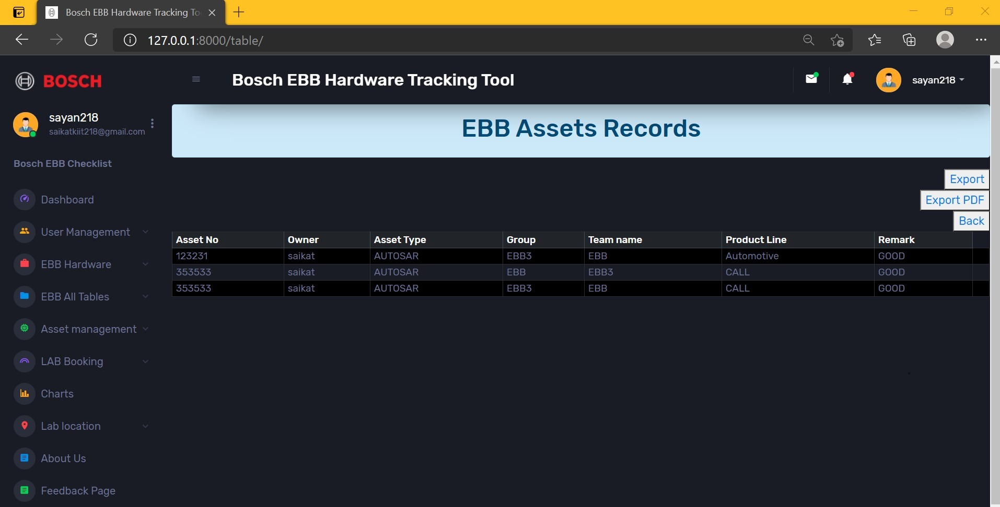

# Bosch EBB ASSET MANAGEMENT SYSTEM

##Installation

1. Install Python
Install python-3.7.2 and python-pip. Follow the steps from the below reference document based on your Operating System. Reference: https://docs.python-guide.org/starting/installation/
   
   
2. Install Django
Follow this steps https://www.djangoproject.com/download/
   
##Set up  the Project environment in pycharm
1) Creating a new project of Project name BoschEBBAsset in the pycharm

2) Go to the terminal of the project

3) Apply command "django-admin startproject BoschEBBAsset"

4) Now create four app account, Dashboard, home , Register in the BoschEBBAsseet project by using the command in the project terminal "python manage.py startapp app_name"

5) Now each and every app create templates and static folder, templates for html files whereas static for javascript ,css and images files

## Edit the project setting

Add all the apps in the project settings.py file

## Adding the URLS of the project file

## Starting the server
1) python manage.py makemigrations

2) python manage.py migrate

3) Run the command in the terminal"python manage.py runserver"

4) Click on the local host http://127.0.0.1:8000/
Home page :
   
SignUp page:

Login page:

Forget password page:

Once the user successfully Login the page he need to provide his asset data in the data filling page
Data filling  page: http://127.0.0.1:8000/account/

User dashboard page: http://127.0.0.1:8000/Dashboard/

Feedback page:

About page:

   

   